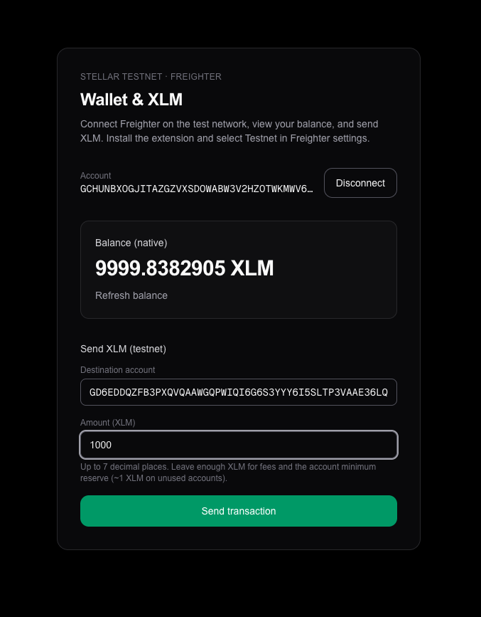
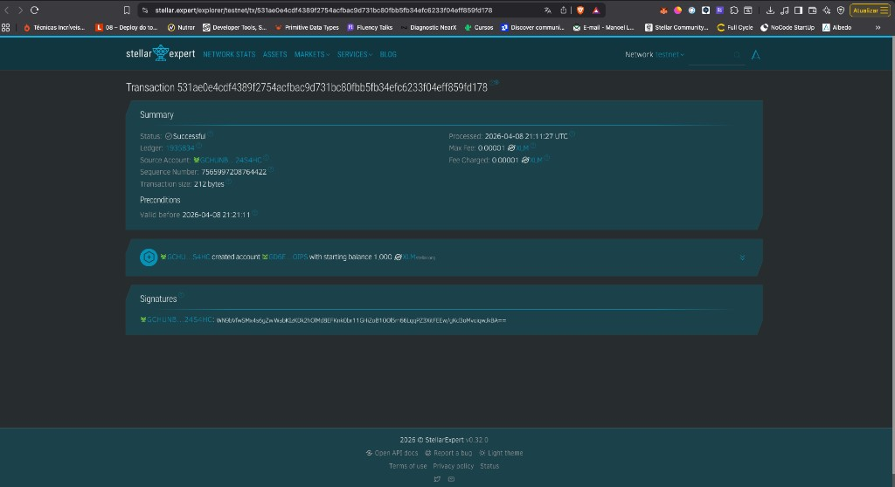
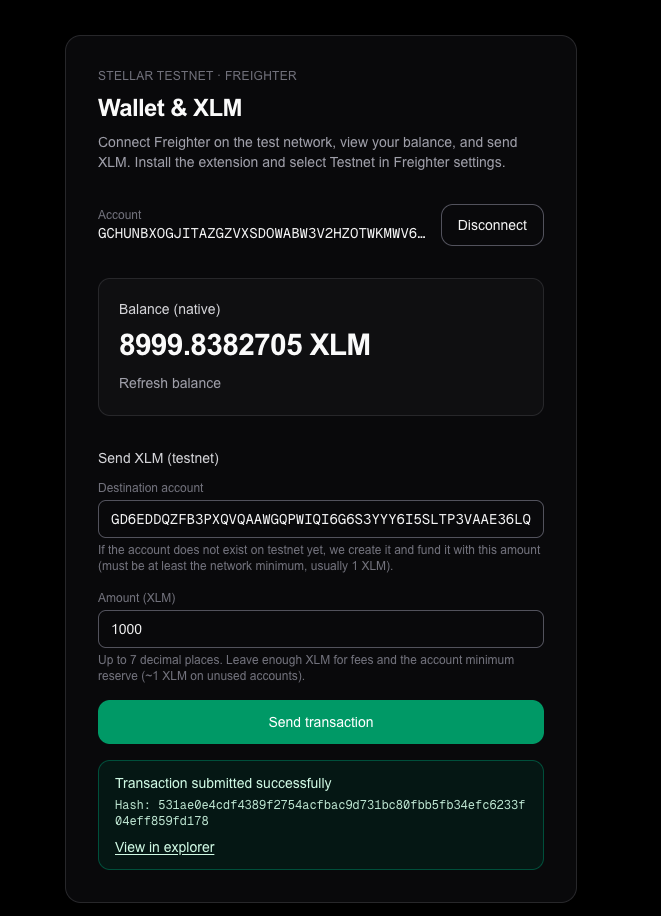

# Stellar Frontend Challenge — Freighter & Testnet

## Project description

This is a [Next.js](https://nextjs.org/) app that connects to the **[Freighter](https://www.freighter.app/)** browser wallet on the **Stellar Testnet**. You can connect and disconnect your wallet, load and display your **native XLM balance** from Horizon, and **send XLM** (including creating a new unfunded account via `create_account` when the destination does not exist yet). After submission, the UI shows **success or failure**, the **transaction hash**, and a link to the block explorer.

**Stack:** Next.js (App Router), React, TypeScript, Tailwind CSS, [`@stellar/freighter-api`](https://www.npmjs.com/package/@stellar/freighter-api), [`@stellar/stellar-sdk`](https://www.npmjs.com/package/@stellar/stellar-sdk).

## Prerequisites

- [Node.js](https://nodejs.org/) (LTS recommended)
- [pnpm](https://pnpm.io/) (this repo uses a `pnpm-lock.yaml`)
- [Freighter](https://www.freighter.app/) installed in your browser, with **Testnet** selected in the extension settings
- Optional: fund your testnet account with the [Stellar Laboratory friendbot](https://laboratory.stellar.org/#account-creator?network=test) or similar if you need XLM

## Setup — run locally

1. **Install dependencies**

   ```bash
   pnpm install
   ```

2. **Start the development server**

   ```bash
   pnpm dev
   ```

3. **Open the app** at [http://localhost:3000](http://localhost:3000).

4. Click **Connect wallet**, approve Freighter, then use **Refresh balance** and **Send transaction** as needed.

**Other scripts**

| Command        | Description              |
| -------------- | ------------------------ |
| `pnpm build`   | Production build         |
| `pnpm start`   | Run production server    |
| `pnpm lint`    | ESLint                   |

## Screenshots

### Wallet connected state

The public key is shown with a **Disconnect** control once Freighter has authorized the app.



### Balance displayed

Native **XLM** balance is loaded from Horizon (testnet) and shown prominently; you can refresh it without sending a transaction.


### Successful testnet transaction

The same operation can be verified on **StellarExpert** (testnet): successful transaction, ledger, fee, and operation details (e.g. account creation or payment).



### Transaction result shown to the user

After Horizon accepts the transaction, the app shows **Transaction submitted successfully**, the **hash**, and **View in explorer** for quick verification.


